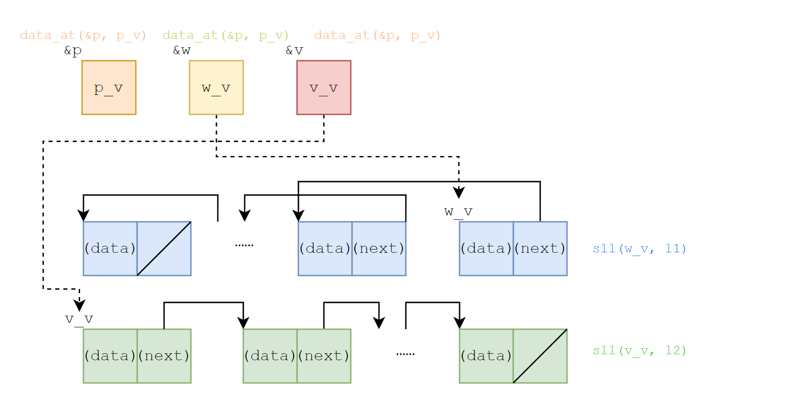
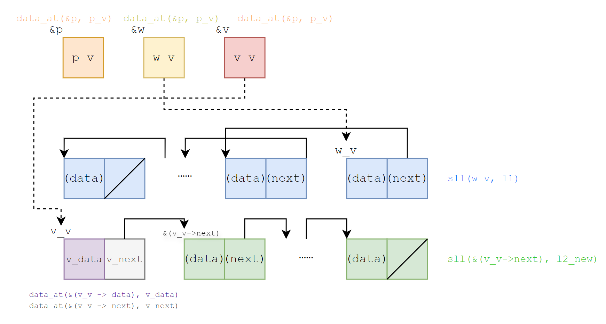

To verify a C function, with respect to a specification, we interleave key assertions and invariants between statements.

# Basic Separation Logic Assertion Language

## Example: list reversal

We can write assertions and invariants as in the following to verify `reverse` in T2.

```c
#include "verification_stdlib.h"
#include "verification_list.h"
#include "sll_def.h"

struct list *reverse(struct list *p) 
/*@ With (l: list Z)
    Require sll(p, l)
    Ensure sll(__return, rev(l))
*/
{
   struct list *w;
   struct list *v;
   w = (void *)0;
   v = p;
   /*@ Assert Inv
          exists p_v w_v v_v l1 l2,
          l == app(rev(l1), l2) &&
          data_at(&p, p_v) *
          data_at(&w, w_v) *
          data_at(&v, v_v) *
          sll(w_v, l1) *
          sll(v_v, l2)
      */
   while (v) {
      /*@ Assert
            exists p_v w_v v_v v_data v_next l2_new l1 l2,
            l == app(rev(l1), l2) &&
            l2 == cons(v_data, l2_new) &&
            data_at(&p, p_v) *
            data_at(&w, w_v) *
            data_at(&v, v_v) *
            data_at(&(v_v -> data), v_data) *
            data_at(&(v_v -> next), v_next) *
            sll(w_v, l1) *
            sll(v_next, l2_new)
      */
      struct list * t;
      t = v -> next;
      v -> next = w;
      w = v;
      v = t;
   }
   return w;
}

```
To clarify, we call variables declared in C (e.g. `w` and `p` in the previous code) "program variables", and quantified variables in annotations (e.g. `l1` and `w_v` in the previous code) "logical variables". In our model, every program variable has an address which stores its value. A program state at a point of execution consists of (1) program variables and their addresses, and (2) values on addresses, or the memory. Assertions describe program states where they stand; or more formally, assertions represent subsets of program states.

The *basic separation logic assertion language*, and in fact the one we use internally, describes the "shape" of the program state and mathematical relations of values separately. We write `data_at(&x, x_v)` to mean that the address of (the program variable) `x` stores the value of (the logical variable) `x_v`. Memory information such as `data_at` are connected by separating conjunction `*`, describing disjoint portions; mathematical relations are typically connected by conjunction `&&`.

Expressions in the basic separation logic assertion language should be effect-free: without C-function calls or memory reads. For example, we should write `exists a_v b_v, a_v == b_v && data_at(&a, a_v) * data_at(&b, b_v)` instead of `a == b` to express that program variables `a` and `b` has the same value. Such stipulation gives assertions a simple rigorous semantics. Assertions such as `a == b` implicitly assume memory permissions; it is hard to transform multiple such expressions, with potentially overlapping memory, to ones that conform "separation". As you can see, writing basic separation logic assertions is tedious. We shall introduce the *concise separation logic assertion language* later.

Now we explain the two annotations in the previous code in detail.

The first annotation locates before entering the loop. The `Inv` at the beginning indicates that it is a loop invariant; that is, what program states should satisfy every time before loop condition. Logical variables `l1` and `l2` are existentially quantified. The former represents the reversed first half of the list, and the latter represents the second half to reverse; therefore `l == app(rev(l1), l2)`. In the memory part, `data_at(&w, w_v)` indicates that the address of `w` stores the value `w_v`; similar for `data_at(&p, p_v)`. As discussed in T1, `sll(w_v, l1)` and similarly `sll(v_v, l2)` indicates that the two pointers store the addresses of list heads. Note that the mathematical relation part comes before the memory part.

The following diagram depicts memory information involved in the first annotation. We assign different colors to memory described by different predicates. (Addresses are marked on the top-left corner; arrows point from pointers to addresses they hold.)



The second annotation locates before the loop body. We are about to access `v -> next`, for which we must explicitly state its permission. This can be proved with the help of the fact `v != 0`. Comparing to the first annotation, we also use `l2_new` to represent the tail of `l2`, thus `l2 == cons(v_data, l2_new)`. Please see the following diagram.



## On pre- and postconditions

The pre- and postcondition of `reverse` are also written in the previously explained syntax, but there are differences. We said that every program variable has an address, hence the tedious `exists p_v, data_at(&p, p_v)`; however, we directly write `sll(p, l)` in precondition. That is because in the function body, the argument `p` works just like a local variable; but from the caller's point of view, it only passes values. These values are what arguments in pre- *and postconditions* mean.

For the same reason, we cannot take the address of function parameters. Consider the following program:

```c
int plus(int x, int y)
/*@ Require emp
    Ensure __return == x + y
*/
{
    int u;
    u = x + y;
    x = x + 100;
    y = y + 100;
    return u;
}
int main()
{
    int a[10];
    scanf("%d%d", &a[1], &a[2], &a[3]);
    printf("%d", plus(a[1]+a[2], a[3]));
    return 0;
}
```

We should not treat `x` and `y` as program variables in the pre- and postcondition of `plus`. On the one hand, the address of `a[1]+a[2]` is unknown to the caller `main`. On the other hand, if we regard `x` and `y` are also regarded as local variables, the postcondition does not hold anymore because their values have changed when exit.

The same applies to list reversal. In practice, to verify the function body our tool first transforms the precondition `sll(p, l)` to `exists p_v, data_at(&p, p_v) * sll(p_v, l)`.

# Concise Separation Logic Assertion Language

The basic separation logic assertion language requires us to write out, if no more than, storage information of every program variable, which effectively requires us to assign every program variable a logical variable representing its value. To alleviate the verbosity, we provide the *concise separation logic assertion language*.

We rewrite the first example as follows.

```c
struct list *reverse(struct list *p) 
/*@ With (l: list Z)
    Require sll(p, l)
    Ensure sll(__return, rev(l))
*/
{
   struct list *w;
   struct list *v;
   w = (void *)0;
   v = p;
   /*@ Assert Inv
          exists p_v l1 l2,
          l == app(rev(l1), l2) &&
          sll(w, l1) * 
          sll(v, l2) *
          data_at(&p, p_v)
      */
   while (v) {
      /*@ Assert
            exists p_v l2_new l1 l2,
            l == app(rev(l1), l2) &&
            l2 == cons(v -> data, l2_new) &&
            sll(w, l1) *
            sll(v -> next, l2_new) *
            data_at(&p, p_v)
      */
      struct list * t;
      t = v -> next;
      v -> next = w;
      w = v;
      v = t;
   }
   return w;
}
```

We replace `exists v_v, data_at(&v, v_v) * sll(v_v, l2)` with `sll(v, l2)`, and `exists w_v data_at(&w, w_v) * sll(w_v, l1)` with `sll(w, l1)`, in the first annotation.

In the second annotation, we replace `exists w_v, data_at(&w, w_v) * sll(w_v, l1)` with `sll(w, l1)`. In `l2 == cons(v -> data, l2_new)`, we implicitly include two memory access: from the address of `v` and from the address of `v -> data`. So it replaces `exists v_v v_data, l2 == cons(v_data, l2_new) && data_at(&v, v_v) * data_at(&(v_v -> data), v_data)`. `sll(v -> next, l2_new)` also includes an access from the address of `v`; this, and the previously mentioned one, are coalesced into one `data_at(&v, v_v)` after being desugared to the basic language.
